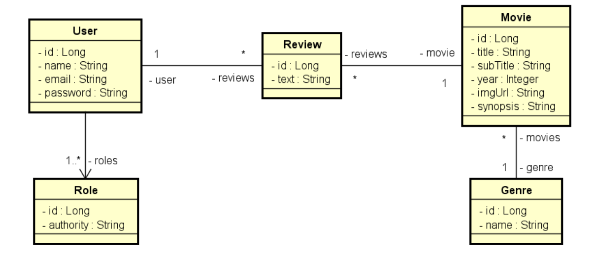

# MovieFlix — Desafio / Casos de Uso

Este projeto tem como objetivo implementar as funcionalidades necessárias para que os testes automatizados do sistema **MovieFlix** sejam aprovados.  
O MovieFlix é uma aplicação de catálogo de filmes, permitindo que usuários listem filmes, filtrem por gênero, visualizem detalhes e realizem avaliações.

---
<figure>
  
  <figcaption>Modelo conceitual Movieflix</figcaption>
</figure>

## 🎥 Funcionalidades

### 1. Listar Filmes
**Descrição:**  
Exibe uma listagem de filmes com paginação, ordenada alfabeticamente por título.

**Entrada:**  
- O usuário (visitante ou membro) pode selecionar **opcionalmente** um gênero.

**Saída:**  
- O sistema exibe:
  - Lista com os nomes de **todos os gêneros**.
  - Lista **paginada** contendo:
    - Título  
    - Subtítulo  
    - Ano  
    - Imagem  
  - A listagem deve ser **atualizada** ao aplicar o filtro de gênero, exibindo apenas filmes pertencentes ao gênero selecionado.

---

### 2. Visualizar Detalhes do Filme
**Descrição:**  
Permite visualizar informações completas de um filme e suas avaliações.

**Entrada:**  
- O usuário (visitante ou membro) seleciona um filme.

**Saída:**  
- O sistema apresenta:
  - Título  
  - Subtítulo  
  - Ano  
  - Imagem  
  - Sinopse  
  - Lista de avaliações do filme, contendo:
    - Texto da avaliação  
    - Nome do usuário que escreveu a avaliação

---

### 3. Avaliar Filme
**Descrição:**  
Um usuário **membro** pode registrar uma nova avaliação para um filme.

**Entrada:**  
- O usuário membro informa **opcionalmente** um texto de avaliação.

**Saída:**  
- O sistema apresenta os dados atualizados do filme, incluindo a nova avaliação.

---

## ❗ Exceções

### 3.1 — Texto Vazio na Avaliação
Caso o usuário tente enviar uma avaliação com texto vazio:
- O sistema deve exibir uma mensagem informando que **não é permitido texto vazio na avaliação**.

---

## ✔ Objetivo Geral
Implementar todas as regras descritas acima de modo que **todos os testes fornecidos no projeto sejam aprovados**, garantindo o funcionamento correto do sistema MovieFlix.

---

## 📁 Estrutura Geral do Projeto
A estrutura pode variar conforme o template do desafio, mas geralmente inclui:

- Entidades  
- Repositórios  
- Serviços  
- DTOs  
- Controladores  
- Testes automatizados cobrindo os casos de uso

---

## 🚀 Tecnologias Utilizadas
As tecnologias normalmente utilizadas neste desafio são:

- Java  
- Spring Boot  
- JPA / Hibernate  
- Banco de dados H2 (para testes)  
- JUnit / Mockito  

---

## 📝 Observações
- Usuários **visitantes** podem listar filmes e visualizar detalhes.  
- Apenas usuários **membros** podem salvar avaliações.  
- Os testes automatizados validam todas as regras de negócio deste desafio.

---

## 📚 Plataforma de Estudos
Este projeto faz parte das atividades da **DevSuperior**, plataforma de ensino especializada em treinamento profissional para desenvolvimento de software.

Acesse: **https://devsuperior.com.br/**

---

## 📚 Licença
Projeto destinado a fins de estudo e avaliação técnica.